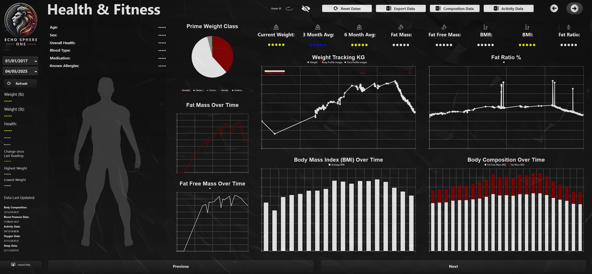

# Health Dashboard

**Developer & Author:** 
Naadir D
Built in Dec 2023 - July 2024



## Overview

This PyQt6 health dashboard skeleton demonstrates advanced data visualization and 3D rendering capabilities. The full implementation supports real-time updates of a 3D body model and comprehensive health metrics analysis.

## Metrics Implemented

- Weight  
- BMI  
- Body Fat Percentage  
- Muscle Mass  
- Visceral Fat  
- Hydration Level  
- Basal Metabolic Rate  

## Features

- **PyQt6 UI** with QtCharts for bar charts, pie charts, and trend lines.
- **3D Visualization:** An OpenGL widget displays a 3D `.obj` model of a human body that dynamically updates to reflect weight and body composition changes.
- **Automated Data Imports:** External processes populate charts within QFrame layouts.
- **Interactive Export:** Click metric titles to export data to Excel as CSV.
- **Dynamic Export Functionality** and interactive dashboard controls for real-time analytics.

## Technologies

- Python 3.x  
- PyQt6  
- PyQt6-OpenGL  
- QtCharts module  
- PyOpenGL  
- pandas, numpy  

## Usage

1. Clone the repository.  
2. Install dependencies with `pip install -r requirements.txt`.  
3. Run the UI:  
   ```bash
   python Ui_healthDashboard.py
   ```


---

